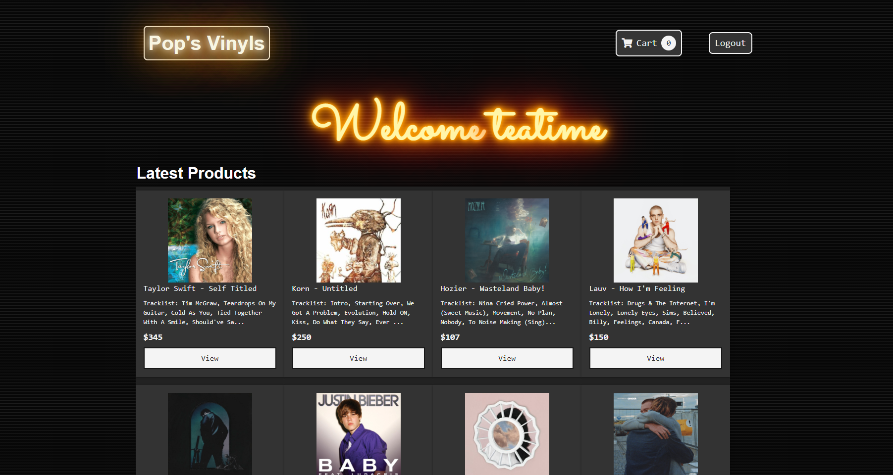

# Pop's Vinyls
## Description
This application is an E-Commerce full MERN application that displays records that can be purchased. When a user signs up they are taken to the main screen to see the products available for sale, each item can be clicked on and added to a cart,  and both the cart and inventory is managed using MongoDB.
## Deployed URL
https://fathomless-garden-67392.herokuapp.com/
### Built With
* React
* React Router
* React Redux
* BCrypt
* JWT
* JavaScript
* GraphQL
* HTML
* CSS
* Boostrap
* Apollo
* Mongoose/MongoDB
## Contributors
* padenallen15
* daxburrato
* daylan-lewandowski
* xdaedx
* chris6661
## Future Development Plans
- add in Stripe for payment
- add multiple pages to see more reocrds
- add genre/category filter
- request bar from customers and anyone who uses the application
